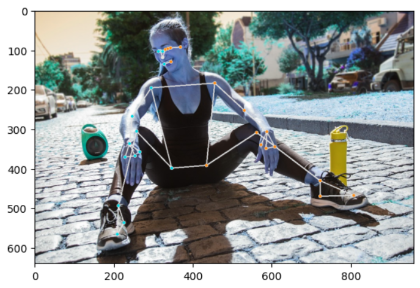

Title: Image annotation with Mediapipe
Category: Image processing
Date: 2025-12-07
Author: Anthony

<!-- Google tag (gtag.js) -->

# Mediapipe

This library from Google can be used to add landmarks to images of people. There are examples of the different things that it can do [here](https://github.com/google-ai-edge/mediapipe-samples/tree/main/examples/object_detection/python). 

This is the example from the demo colab

There are 2 things that I might want to do with this:

- I am going to try to use this to process my Irish Dancer pictures to find the dancer in them. This is an alternative to labeling in the browser. 
- Write some software to 'observe' me doing bodyweight exercises. Things like determining if my shoulders are level during pushups. 

Before I settled on mediapipe I took a look at some other posemodels. [This model](https://github.com/CMU-Perceptual-Computing-Lab/openpose?tab=readme-ov-file) from CMU was a bit cumbersome to run on wsl. I don't want to have to compile any C++ on wsl as there is a good chance that it will not work. 

