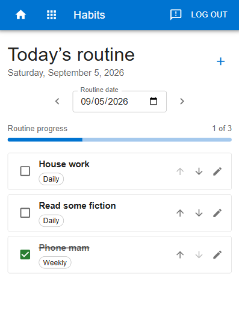

Title: Habit Tracker
Category: Grimoire
Date: 2026-09-05
Author: Anthony

<!-- Google tag (gtag.js) -->

I have added a simple habit tracker to my Grimoire AI application. It just let's me tick off a daily checklist of things I want to do every day. I have been using it this week and have found it very useful so far. 

