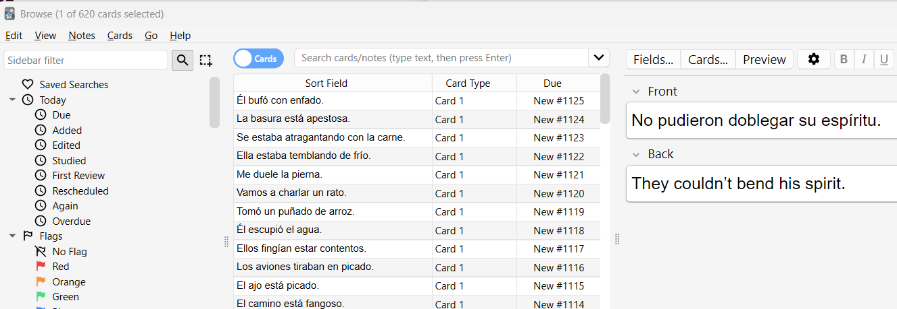

Title: Spanish learning progress
Category: Spanish
Date: 2025-10-04
Author: Anthony

<!-- Google tag (gtag.js) -->

# Five Months Into Learning Spanish  

It’s been five months since I set myself the goal of learning Spanish, and overall it’s been going pretty well — though not without a few low points.  

I reached B1 level on Busuu, but I started to feel that the lessons were getting fiddly. I was being introduced to concepts like the subjunctive that felt a bit ahead of where I was. What I really needed was more exposure to the basics before moving on. In the end, I cancelled my subscription. That said, at just €11 per month, it was excellent value for the grammar foundation I built, and I may well return to it later to pick up B2.  

## Harry Potter and Anki  

After Busuu, I went back to reading *Harry Potter y la piedra filosofal*. At first, I could only manage about a page per day because I had to stop and translate almost everything. I’d use ChatGPT to translate the new words and then ask it to give me simple example sentences, which I added to my Anki deck. It wasn’t much fun at the beginning — it felt like a slog — but it has paid off.  

Now, I can read a few pages without needing a dictionary, and I’m actually enjoying the story. My Anki deck has grown to over 600 words, with 10–20 new ones added daily. True, much of this vocabulary is wizard- and spell-related, but that’s hardly a bad thing. Once I finish Harry Potter, I’ll move on to broader sources.  

## The 1,000-Word Goal  

With around 600 words under my belt, I’ve realised that reaching 1,000 will put me in a strong position with a solid set of everyday vocabulary. I have about 60 pages left in Harry Potter, which I should finish by the end of the month. That should bring me close to the 1,000 mark.  

## Spanish on Screen  

I’ve also started experimenting with Spanish TV. I tried a Spanish drama on Netflix with both Spanish audio and Spanish subtitles, and it was tough — but I understood more than I expected. Watching regular content with Spanish subtitles is another option I want to explore soon.  

## Looking Ahead  

All in all, I’m happy with my progress. Stepping back now and again helps me appreciate how far I’ve come. My original goal was to get around more easily on holiday in Spain, and I feel I’ve already achieved that. Now I want to aim higher: reading Spanish books, not just children’s ones but eventually adult novels too.  

In an ideal world, by the end of this year I’ll have learned enough Spanish to consider the project “complete” — not that I’ll stop, but that I’ll be able to focus on using the language naturally: reading for fun, watching shows, and finding opportunities to speak with native speakers.  

Looking back, I’ve gone from struggling with a single page to reading chapters and enjoying Spanish TV. Looking forward, the idea of picking up an adult novel and diving into it in Spanish feels like a challenge I’m ready to take on.  
