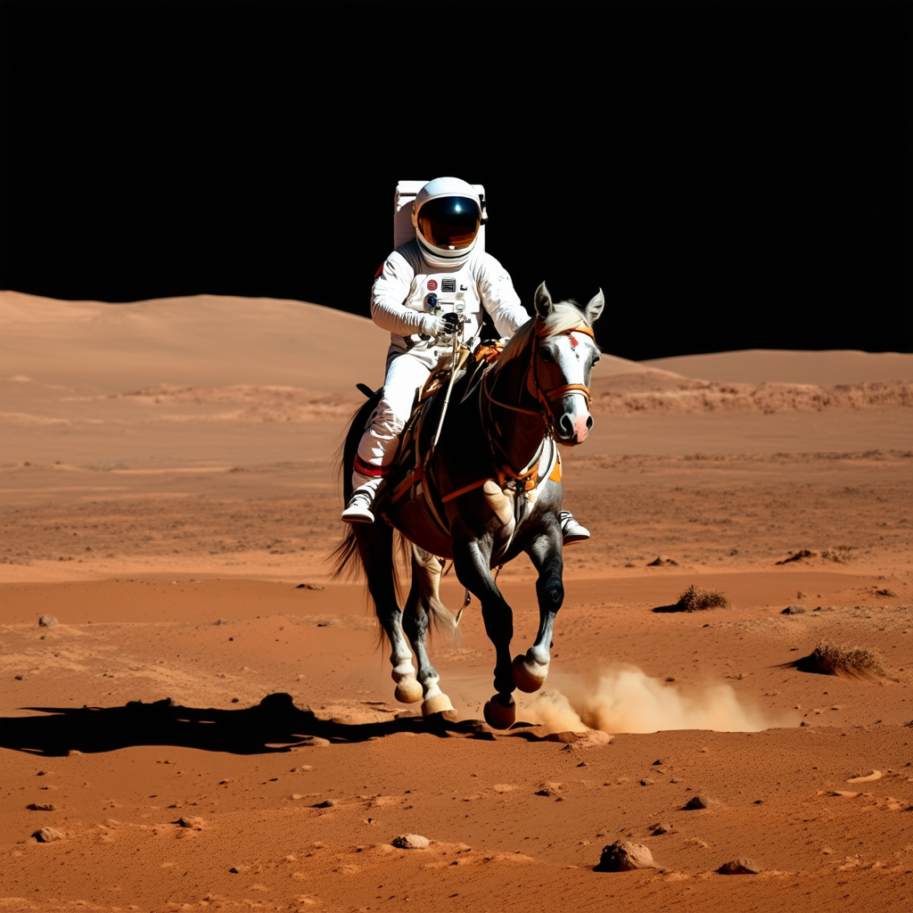
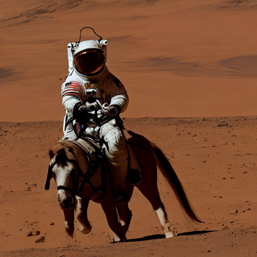

Title: Stable Diffusion 3.5
Category: AI
Date: 2026-09-03
Author: Anthony

<!-- Google tag (gtag.js) -->
<script async src="https://www.googletagmanager.com/gtag/js?id=G-FYDC27JYB4"></script>
<script>
  window.dataLayer = window.dataLayer || [];
  function gtag(){dataLayer.push(arguments);}
  gtag('js', new Date());

  gtag('config', 'G-FYDC27JYB4');
</script>

My previous experiments with Stable Diffusion have used an older (and smaller) version: 1.4. The most recent version available is 3.5. There have been a lot of changes so I wanted to see if image generation itself had improved much. 

This is the model_id and pipeline to use for this:

```
model_id = "stabilityai/stable-diffusion-3.5-medium"
device = "cuda"

pipe = StableDiffusion3Pipeline.from_pretrained(model_id, dtype=torch.float16)
pipe = pipe.to(device)
```

This model weighs in at 16 Gb on disk, so be prepared for a wait, but once it is in your cache it is just a few seconds to get it into memory. 

My overall plan here is to investigate morphing one face into another. I had been using 1.4 which is nice and light, but got quite blurred results for the intermediates. Not much better than just tweening pixel intensities I would say. This is why I made the jump to the bigger model. However I won't be doing many experiments with 3.5 as it is just too compute hungry. My small gpu on my laptop took 25 minutes to produce a single image based on this code.

```
prompt = "a photo of an astronaut riding a horse on Mars"

image = pipe(prompt).images[0]  
```



And this is a version from 1.4



So pretty much worth the wait. A big leap in image quality and the prompt is extremely basic too. The hardware I have is just not suitable for this level of model, but the result shows what can be done with open technology. 