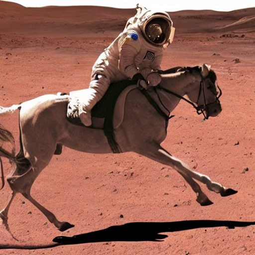
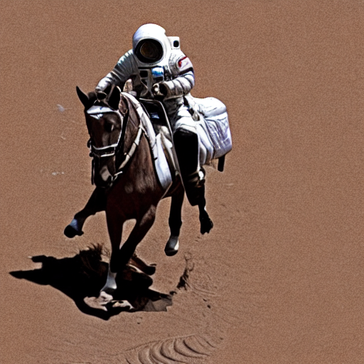

Title: Stable Diffusion
Category: AI
Date: 2026-09-02
Author: Anthony

<!-- Google tag (gtag.js) -->
<script async src="https://www.googletagmanager.com/gtag/js?id=G-FYDC27JYB4"></script>
<script>
  window.dataLayer = window.dataLayer || [];
  function gtag(){dataLayer.push(arguments);}
  gtag('js', new Date());

  gtag('config', 'G-FYDC27JYB4');
</script>

It has been a while since stable diffusion has been the king of image models. For day to day image generation leading llms have become very good at this - Chat GPT for example can produce very high quality images. I wanted to understand a bit more about how these models work, so the first step is to give them a try.

You can get Stable Diffusion from Huggingface. [Here](https://huggingface.co/CompVis/stable-diffusion-v1-4) is the 1.4 variant which seems to be most recent version available. This code is enough to get you a pipeline from which you can generate images:

```
import matplotlib.pyplot as plt
import torch
from diffusers import StableDiffusionPipeline
from IPython.display import HTML
from matplotlib.animation import FuncAnimation

model_id = "CompVis/stable-diffusion-v1-4"
device = "cuda"

pipe = StableDiffusionPipeline.from_pretrained(model_id, dtype=torch.float16)
pipe = pipe.to(device)
```

This code will give you an image. There is huge variability in the output and some of it is pretty bad compared to what we have become used to recently, but a model like this is probably more amenable to playing with and figuring out the internals. 

```
prompt = "a photo of an astronaut riding a horse on Mars"

image = pipe(prompt).images[0]  

display(image)
```

This call to the pipeline uses the default number of iterations which is 50. 

I was interested in looking at the progress of the image generation process. Stable Diffusion does its iterations on the latent space rather than directly on image space. Only at the last step is the most recent version of the latent space turned into an image. So to see progress a callback is needed. This is computationally expensive. The decoding of the latent space into an image is usually once per generation sequence, with the callback it is happening maybe every time. Even with this though on my laptop GPU I can generate an image in about 20 seconds. 

This is the code for the callback. 

```
frames = []
def callback(pipe, step, timestep, cwargs):
    latents = cwargs["latents"]
    with torch.no_grad():
        decoded = pipe.vae.decode(
            latents/pipe.vae.config.scaling_factor,
            return_dict=False
        )[0]
    images = pipe.image_processor.postprocess(
        decoded,
        output_type="pil"
    )
    frames.append(images[0])
    return cwargs


image = pipe(prompt, 
            num_inference_steps=30,
            callback_on_step_end=callback,
            callback_on_step_end_tensor_inputs=["latents"]).images[0]  
```

This gives you a list of images which you can then page through in an animation. One of the things that came up from doing this was that more iterations is not necessarily better. About 30 seems to get a good result. If the model makes a gross mistake initially no number of refining iterations is going to fix that. This is a bit of a relief as I always feel that more compute would get me a better result, but that is not the case here. 

Overall this is a fun tool to play with. You can examine the model and pull out individual components to use them. This is exactly what is happing in the callback code above using the vae layer. 

And here are some examples of the images I have created





They are definitely astronauts riding a horse on Mars alright.